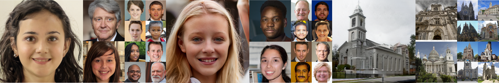
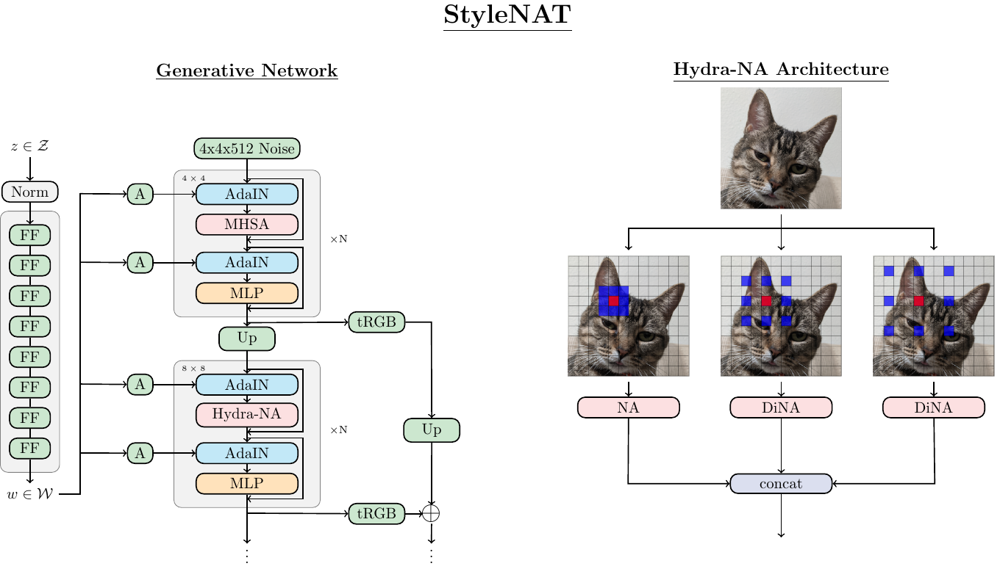
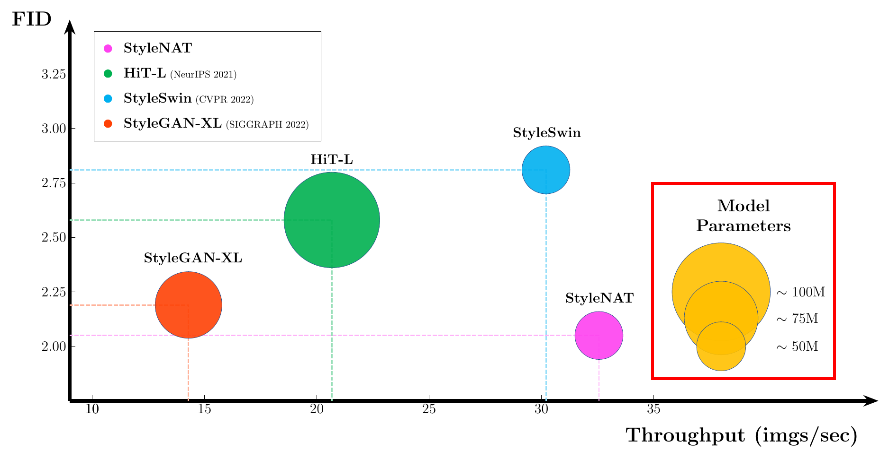

## StyleNAT: Giving Each Head a New Perspective
<a href="https://arxiv.org/abs/2211.05770"></a>

[](https://paperswithcode.com/sota/image-generation-on-ffhq-256-x-256?p=stylenat-giving-each-head-a-new-perspective)
[](https://paperswithcode.com/sota/image-generation-on-ffhq-1024-x-1024?p=stylenat-giving-each-head-a-new-perspective)
[](https://paperswithcode.com/sota/image-generation-on-lsun-churches-256-x-256?p=stylenat-giving-each-head-a-new-perspective)

##### Authors: [Steven Walton](https://github.com/stevenwalton), [Ali Hassani](https://github.com/alihassanijr), [Xingqian Xu](https://github.com/xingqian2018), Zhangyang Wang, [Humphrey Shi](https://github.com/honghuis)


StyleNAT is a Style-based GAN that exploits [Neighborhood
Attention](https://github.com/SHI-Labs/Neighborhood-Attention-Transformer) to
extend the power of localized attention heads to capture long range features and
maximize information gain within the generative process.
The flexibility of the the system allows it to be adapted to various
environments and datasets.

## Abstract:
Image generation has been a long sought-after but challenging task, and performing the generation task in an efficient manner is similarly difficult.
Often researchers attempt to create a "one size fits all" generator, where there are few differences in the parameter space for drastically different datasets.
Herein, we present a new transformer-based framework, dubbed StyleNAT, targeting high-quality image generation with superior efficiency and flexibility. 
At the core of our model, is a carefully designed framework that partitions attention heads to capture local and global information, which is achieved through using Neighborhood Attention (NA).
With different heads able to pay attention to varying receptive fields, the model is able to better combine this information, and adapt, in a highly flexible manner, to the data at hand.
StyleNAT attains a new SOTA  FID score on FFHQ-256 with 2.046, beating prior arts with convolutional models such as StyleGAN-XL and transformers such as HIT and StyleSwin, and a new transformer SOTA on FFHQ-1024 with an FID score of 4.174.
These results show a 6.4% improvement on FFHQ-256 scores when compared to StyleGAN-XL with a 28% reduction in the number of parameters and 56% improvement in sampling throughput. 

## Architecture


## Performance


Dataset | FID | Throughput (imgs/s) | Number of Parameters (M) |
|:---:|:---:|:---:|:---:|
FFHQ 256 | 2.046 | 32.56 | 48.92 |
FFHQ 1024 | 4.174  | - | - |
Church 256 | 3.400  | - | - |


## Citation:
```bibtex
@article{walton2022stylenat,
    title         = {StyleNAT: Giving Each Head a New Perspective},
    author        = {Steven Walton and Ali Hassani and Xingqian Xu and Zhangyang Wang and Humphrey Shi},
    year          = 2022,
    url           = {https://arxiv.org/abs/2211.05770},
    eprint        = {2211.05770},
    archiveprefix = {arXiv},
    primaryclass  = {cs.CV}
}
```
